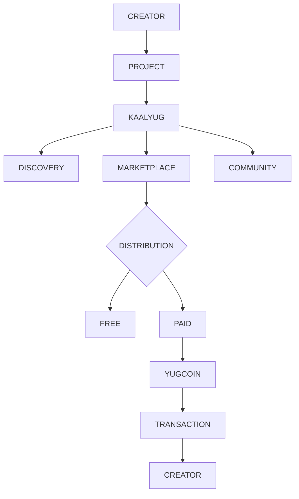
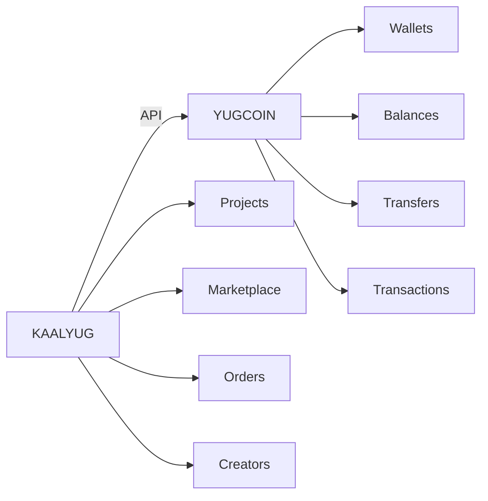
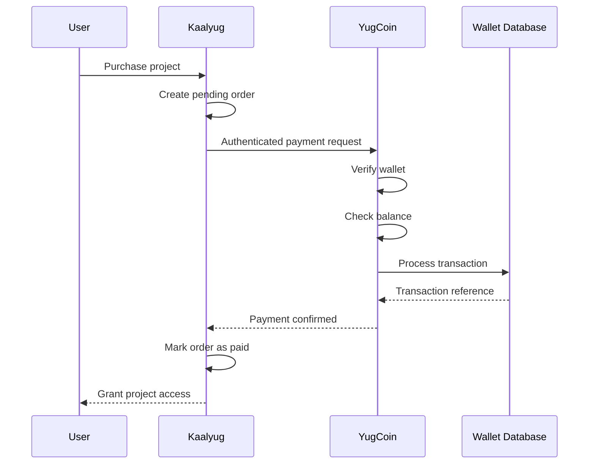
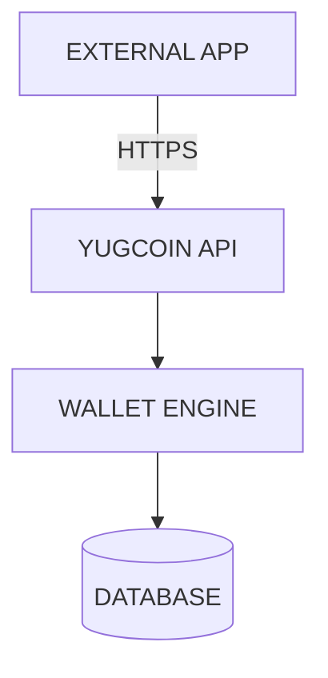
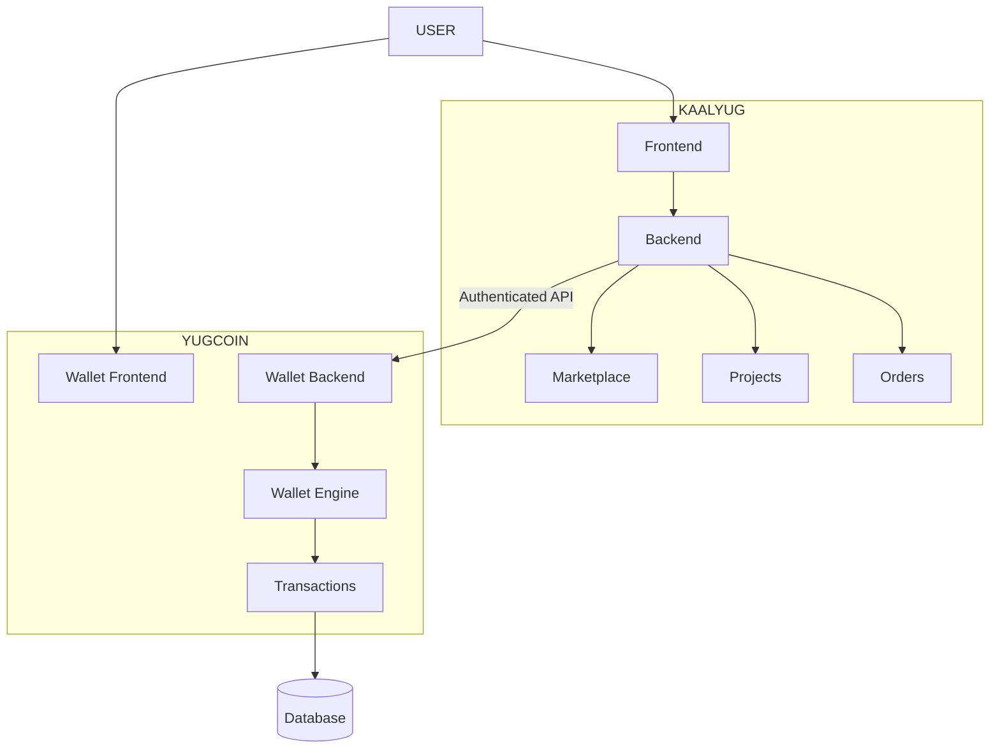
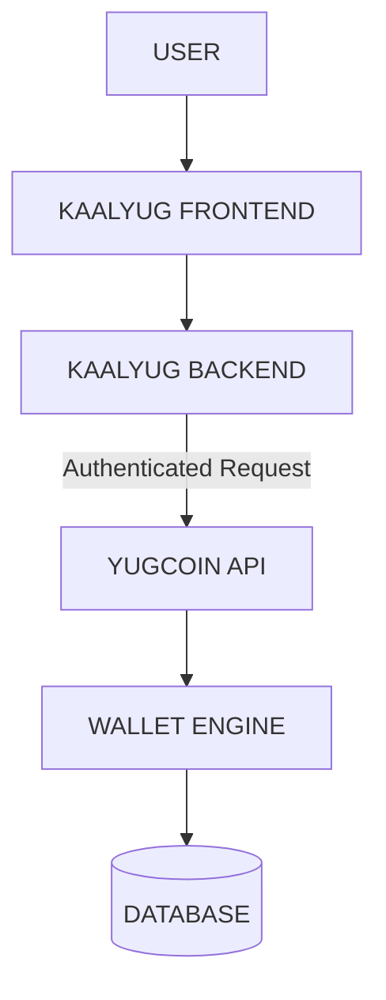
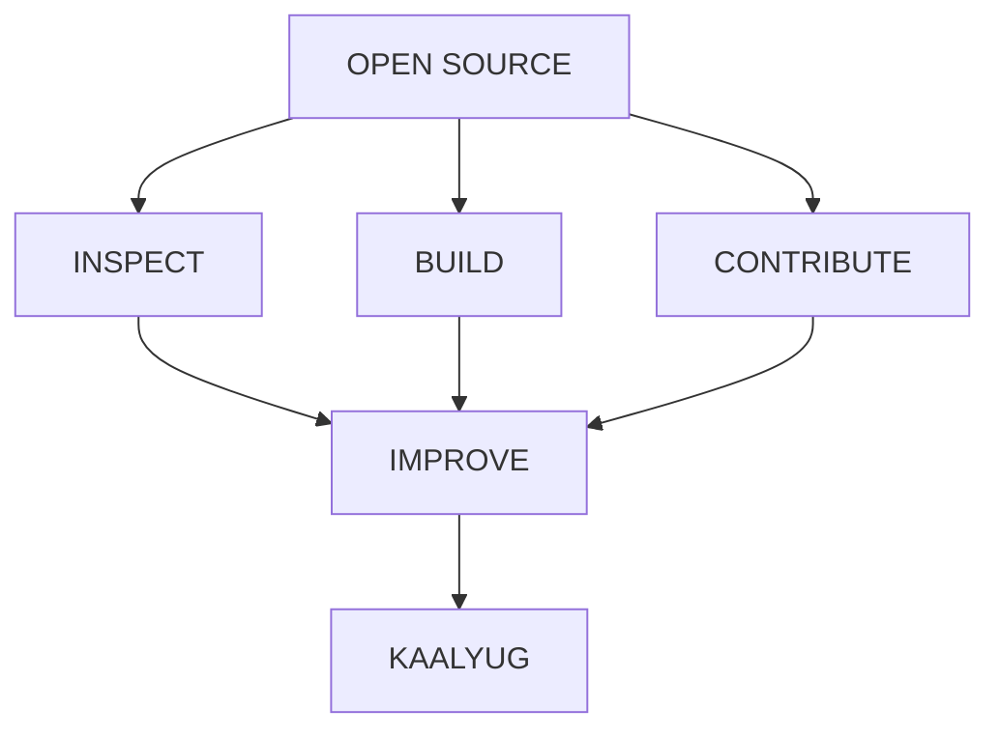
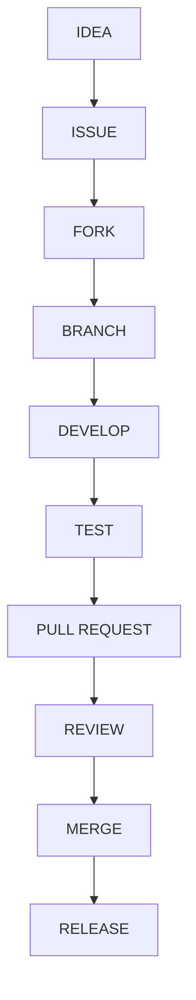
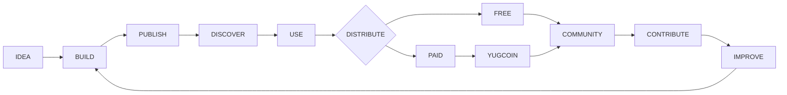
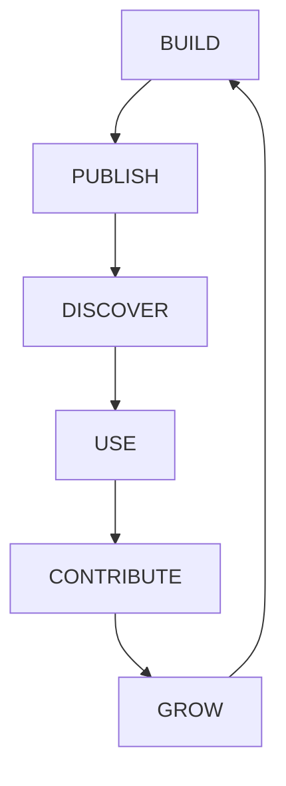

<div align="center">

# KAALYUG

### THE DIGITAL ECOSYSTEM FOR BUILDERS

**Build · Publish · Discover · Exchange**

An open-source ecosystem connecting developers, creators, digital projects, marketplace distribution, and YugCoin-powered transactions.


</div>

---

## 01 — The Idea

The internet is full of people building things.

Projects are created in one place, showcased somewhere else, distributed through another service, and monetized through completely separate systems.

Kaalyug is built around connecting that lifecycle.

```
   CREATE
     │
     ▼
   PUBLISH
     │
     ▼
   DISCOVER
     │
     ▼
    USE
     │
     ▼
   EXCHANGE
     │
     ▼
    GROW
```

Kaalyug turns a digital project into more than a repository. It becomes a discoverable, presentable, distributable object inside an ecosystem.

---

## 02 — What Is Kaalyug?

Kaalyug is an open-source digital ecosystem and marketplace for software projects and digital creations.

Creators can publish projects, users can discover them, developers can contribute to them, and eligible projects can be distributed through a free or paid model.

At the center of the ecosystem is **YugCoin** — the connected wallet and transaction engine designed to handle marketplace payments.



---

## 03 — The Ecosystem

Kaalyug is not just one page or one marketplace. It is designed as a collection of connected layers.

| Layer | Purpose |
|---|---|
| Discovery | Find projects, tools, applications and creations |
| Creators | Give builders a public identity |
| Projects | Present complete projects in a structured format |
| Marketplace | Distribute free and paid digital products |
| Community | Connect people around projects |
| YugCoin | Provide the wallet and transaction layer |
| Open Source | Enable contribution, transparency and collaboration |

The ecosystem can grow without forcing every component into a single responsibility.

---

## 04 — Projects

A project on Kaalyug isn't simply `project.zip`. It is a structured digital product.

```
┌───────────────────────────────────────────┐
│                                            │
│              PROJECT PREVIEW              │
│                                            │
├───────────────────────────────────────────┤
│  Name                                     │
│  Creator                                  │
│  Description                              │
│                                            │
│  Features                                 │
│  Version                                  │
│  Documentation                            │
│  Repository                               │
│                                            │
│  Distribution       FREE / PAID           │
│                                            │
└───────────────────────────────────────────┘
```

Projects can contain:

- Complete applications
- Websites
- Web tools
- UI projects
- Templates
- Developer utilities
- Open-source software
- Digital resources
- Community projects

---

## 05 — Free × Paid

Kaalyug intentionally supports both sides of digital distribution.

**Open**

Projects can be published freely for the community.

```
   CREATOR
     │
     ▼
   PROJECT
     │
     ▼
  COMMUNITY
     │
     ├── USE
     ├── STUDY
     ├── SHARE
     └── CONTRIBUTE
```

**Marketplace**

Creators can also publish projects as paid digital products.

```
   CREATOR
     │
     ▼
   PROJECT
     │
     ▼
  MARKETPLACE
     │
     ▼
    BUYER
     │
     ▼
   YUGCOIN
     │
     ▼
  TRANSACTION
```

The same ecosystem therefore supports open collaboration and creator monetization.

---

## 06 — YugCoin

**The transaction layer.**

YugCoin (YC) is the wallet engine designed for the Kaalyug ecosystem.

> It is a digital wallet/payment system, not a public cryptocurrency.

YugCoin is responsible for the financial logic of the ecosystem while Kaalyug remains responsible for the marketplace experience.

**Separation of responsibilities**



This separation is intentional. Kaalyug knows *what* is being purchased. YugCoin knows *how* the transaction happens.

---

## 07 — The Payment Engine

A marketplace purchase follows a controlled path:



The important principle:

> Kaalyug does not directly modify wallet balances.

The wallet engine remains responsible for the actual transaction.

---

## 08 — Wallet Preview

YugCoin is designed to feel native to the Kaalyug experience.

A lightweight wallet preview can appear inside the marketplace:

```
╭─────────────────────────────────╮
│  YUGCOIN                        │
│                                  │
│  AVAILABLE BALANCE               │
│  1,250.50 YC                     │
│                                  │
│  YC •••••• 291                   │
│                                  │
│  ● WALLET CONNECTED              │
│                                  │
│  ─────────────────────────────   │
│          OPEN WALLET             │
╰─────────────────────────────────╯
```

And during checkout:

```
╭─────────────────────────────────╮
│  KAALYUG CHECKOUT                │
│                                  │
│  Project              250 YC     │
│                                  │
│  Wallet balance     1,250 YC     │
│  After payment      1,000 YC     │
│                                  │
│  ─────────────────────────────   │
│                                  │
│          PAY 250 YC              │
╰─────────────────────────────────╯
```

The objective is simple: the wallet should feel like part of Kaalyug — not an unrelated application.

---

## 09 — API Architecture

YugCoin already contains the wallet engine. The API becomes the controlled interface through which other applications communicate with it.



Example endpoints can include:

```
GET  /api/wallet/balance
POST /api/payments
GET  /api/payments/:reference
GET  /api/transactions/:reference
```

The API does not duplicate the wallet logic. It exposes the existing engine through controlled, authenticated routes.

---

## 10 — System Architecture



**Architecture principle:** Separate the responsibilities. Connect the systems.

This keeps the marketplace and wallet engine independently maintainable.

---

## 11 — Security Model

The frontend should never be trusted with sensitive transaction decisions.

The intended request path is:



Core principles:

- Server-side validation
- Authenticated API communication
- Protected API credentials
- Balance verification
- Unique transaction references
- Order/payment IDs
- Idempotent payment requests
- Atomic transaction processing
- Environment-based secrets
- No private API credentials in frontend code

---

## 12 — Built for Real Hardware

Kaalyug is designed with a practical constraint:

> Good software should not require expensive hardware.

The platform aims to remain usable across:

**Low-end phones + Older laptops + Limited hardware + Slower networks = Accessible ecosystem**

Performance is therefore considered part of the product.

The goal is **not** "make it look impressive at any cost." The goal is "make it look impressive while remaining usable."

---

## 13 — Design Language

Kaalyug follows a deliberately restrained visual direction.

| Principle | Description |
|---|---|
| **Dark** | A strong dark interface creates the foundation |
| **Clean** | Information should remain understandable before decoration takes over |
| **Technical** | The visual language reflects the developer-focused nature of the ecosystem |
| **Premium** | Projects and creators should feel like first-class products |
| **Responsive** | The experience should adapt rather than simply shrink |
| **Purposeful** | Motion, effects and visual elements should communicate something |

---

## 14 — Open Source

Kaalyug is being developed as an open-source project.

The repository is intended to provide a foundation that developers can inspect, learn from, modify and contribute to.



Contributions can include:

- Bug fixes
- UI improvements
- Performance improvements
- New marketplace capabilities
- API integrations
- Documentation
- Security improvements
- Developer tooling
- Ecosystem ideas

> A public repository alone does not make software open source. Licensing is what grants others the permissions to use, modify and distribute it.

The project should include an appropriate open-source `LICENSE` file defining how others may use, modify and distribute the software.

---

## 15 — Contribution Flow



Kaalyug is designed to grow with its contributors rather than only through its original implementation.

---

## 16 — Project Structure

The ecosystem is conceptually divided into independent responsibilities:

```
Kaalyug
│
├── Frontend
│   ├── Marketplace
│   ├── Discovery
│   ├── Project pages
│   ├── Creator profiles
│   └── Wallet interface
│
├── Backend
│   ├── Users
│   ├── Projects
│   ├── Marketplace
│   ├── Orders
│   └── YugCoin integration
│
└── Ecosystem
    ├── Open-source projects
    ├── Free projects
    ├── Paid projects
    └── Community contributions
```

The exact implementation may evolve as the platform develops.

---

## 17 — Development Roadmap

**Foundation**
- Core UI
- Marketplace foundation
- Project discovery
- Creator profiles
- Responsive experience

**Publishing**
- Project publishing
- Project versions
- Project previews
- Free distribution
- Paid distribution

**YugCoin**
- Wallet integration
- Balance preview
- Payment API
- Marketplace checkout
- Transaction references

**Ecosystem**
- Community
- Analytics
- Reviews
- Creator tools
- Collaboration
- Mobile applications
- Additional ecosystem services

The roadmap is intentionally evolutionary. Features should be introduced when their underlying systems are ready.

---

## 18 — Versioning

Kaalyug follows an incremental product-development philosophy.

| Version | Focus |
|---|---|
| **v1.0** | Foundation — Core experience |
| **v1.1** | Refinement — Marketplace improvements |
| **v1.2** | Publishing — Creator systems |
| **v1.3** | YugCoin — Transaction integration |
| **v1.x** | Ecosystem expansion |

Versions should represent meaningful milestones rather than arbitrary changes.

---

## 19 — The Bigger Picture

The long-term model looks like this:



This creates a continuous loop:

> Build → Publish → Discover → Use → Contribute → Build again.

That loop is the core idea behind Kaalyug.

---

## 20 — Why Kaalyug?

Because a project should be able to become more than a repository. It should have:

- **Identity** — Creator, Version, Preview, Documentation
- **Discovery** — Search, Categories, Community
- **Distribution** — Free, Paid
- **Transaction** — YugCoin
- **Community** — Contribution, Collaboration

Kaalyug brings these concepts together into one ecosystem.

---

## 21 — Current Status

**Active Development**

Kaalyug is an evolving project. The current architecture establishes the foundation for:

- Digital project discovery
- Creator-oriented publishing
- Marketplace distribution
- Free and paid projects
- YugCoin integration
- Open-source collaboration
- Low-end device accessibility

Some ecosystem capabilities represent the planned direction of the platform and will be introduced progressively.

---

## 22 — Philosophy



Build something. Put it into the ecosystem. Let it evolve.

---

## 23 — Quick Start

### Prerequisites
- Node.js (`>=20 <23`)
- MongoDB running locally or a MongoDB Atlas URI

### 1. Backend Setup
```bash
cd backend
npm install
cp .env.example .env
npm run dev
```
The API starts on `http://localhost:5000`.

### 2. Frontend Setup
```bash
cd frontend
npm install
cp .env.example .env
npm run dev
```
The application opens on `http://localhost:5173`.

---

<div align="center">

### KAALYUG

**BUILD • PUBLISH • DISCOVER • EXCHANGE**

An open-source digital ecosystem for creators and builders.

© Kaalyug — Open Source — Active Development

</div>
